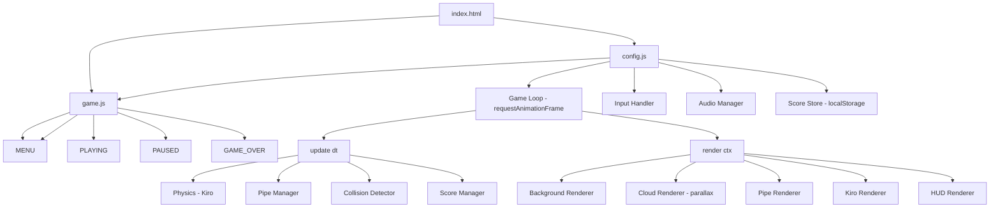

# Design Document: Flappy Kiro

## Overview

Flappy Kiro is a single-file (or minimal multi-file) browser-based game built with vanilla HTML5, CSS, and JavaScript using the Canvas API. No build tools or frameworks are required — the game runs by opening `index.html` in any modern browser.

The architecture follows a simple game loop pattern: a central `Game` object owns all state, an `update()` function advances physics and logic each frame, and a `render()` function draws everything to the canvas. Input events mutate state directly. Audio is handled via the Web Audio API with HTML `<audio>` elements as a fallback.

## Architecture



## Components and Interfaces

### GameState

An enum-like constant object representing the four possible states:

```js
const STATE = { MENU: 'menu', PLAYING: 'playing', PAUSED: 'paused', GAME_OVER: 'game_over' };
```

### Game Object

The top-level singleton that owns all mutable state:

```js
{
  state: STATE.MENU,
  score: 0,
  highScore: 0,       // loaded from localStorage on init
  kiro: Kiro,
  pipes: Pipe[],
  clouds: Cloud[][],  // array of layers, each layer is an array of Cloud
  frame: number,      // frame counter for pipe spawning
}
```

### Kiro

```js
{
  x: number,          // fixed horizontal position
  y: number,          // vertical position (pixels from top)
  vy: number,         // vertical velocity (pixels/frame, positive = down)
  width: number,
  height: number,
  image: HTMLImageElement,
}
```

### Pipe

```js
{
  x: number,          // left edge of pipe
  gapTop: number,     // y coordinate of top of gap
  gapBottom: number,  // y coordinate of bottom of gap
  width: number,
  scored: boolean,    // true once Kiro has passed this pipe
}
```

### Cloud

```js
{
  x: number,
  y: number,
  width: number,
  height: number,
  speed: number,      // pixels per frame (layer-dependent)
  alpha: number,      // opacity 0.0–1.0
}
```

### AudioManager

Wraps `HTMLAudioElement` instances. Provides `play(name)` and `playLoop(name)` / `stopLoop()`. Silently catches errors for unsupported browsers.

```js
{
  sounds: { jump, score, gameOver, music },
  play(name): void,
  playLoop(name): void,
  stopLoop(): void,
}
```

### ScoreStore

Thin wrapper around `localStorage`:

```js
{
  load(): number,
  save(score: number): void,
}
```

## Data Models

### Constants

```js
const GRAVITY        = 0.5;   // px/frame²
const JUMP_VELOCITY  = -9;    // px/frame (negative = up)
const PIPE_SPEED     = 3;     // px/frame
const PIPE_INTERVAL  = 90;    // frames between pipe spawns
const GAP_HEIGHT     = 160;   // px
const GAP_MIN_Y      = 80;    // minimum gapTop from canvas top
const PIPE_WIDTH     = 60;    // px
const CLOUD_LAYERS   = [
  { speed: 0.4, alpha: 0.25, count: 4 },  // distant, slow, more transparent
  { speed: 1.0, alpha: 0.45, count: 3 },  // mid
  { speed: 1.8, alpha: 0.60, count: 2 },  // close, fast, more opaque
];
const FOOTER_HEIGHT  = 40;    // px — dark bar at bottom
```

### Collision Model

Axis-aligned bounding box (AABB) check between Kiro's rectangle and each pipe rectangle (top pipe body + bottom pipe body). Out-of-bounds checks compare Kiro's top edge against 0 and Kiro's bottom edge against `canvas.height - FOOTER_HEIGHT`.

## Correctness Properties

A property is a characteristic or behavior that should hold true across all valid executions of a system — essentially, a formal statement about what the system should do. Properties serve as the bridge between human-readable specifications and machine-verifiable correctness guarantees.

Property 1: Physics update applies gravity and advances position
*For any* Kiro state `(y, vy)` with no jump input, after one physics update: `vy_new === vy + GRAVITY` and `y_new === y + vy_new`. This covers both gravity application and position integration in a single combined property.
**Validates: Requirements 2.1, 2.3**

Property 2: Jump sets upward velocity
*For any* Kiro state, after a jump input is applied, `vy === JUMP_VELOCITY` (a negative value, i.e. upward).
**Validates: Requirements 2.2**

Property 3: Pipe gap height is always fixed
*For any* generated Pipe, `gapBottom - gapTop === GAP_HEIGHT`.
**Validates: Requirements 3.5**

Property 4: Pipe gap is always within canvas bounds
*For any* generated Pipe and canvas height, `gapTop >= GAP_MIN_Y` and `gapBottom <= canvasHeight - FOOTER_HEIGHT - GAP_MIN_Y`.
**Validates: Requirements 3.4**

Property 5: Pipes scroll left every frame
*For any* active Pipe at position `x`, after one update tick, `pipe.x === x - PIPE_SPEED`.
**Validates: Requirements 3.2**

Property 6: Off-screen pipes are removed from the active list
*For any* Pipe where `pipe.x + pipe.width < 0`, the pipe must not appear in the active pipe list after the next update call.
**Validates: Requirements 3.3**

Property 7: Score increments exactly once per pipe
*For any* Pipe_Pair, the Score increments by exactly 1 the first time Kiro's x passes the pipe's right edge, and never increments again for that same pipe (idempotent via the `scored` flag).
**Validates: Requirements 5.1**

Property 8: High score is non-decreasing across sessions
*For any* sequence of completed game sessions, the stored High_Score after session N+1 is always `>=` the stored High_Score after session N.
**Validates: Requirements 6.7**

Property 9: localStorage round-trip preserves high score
*For any* non-negative integer score, saving it via `ScoreStore.save(score)` then loading via `ScoreStore.load()` returns the same value.
**Validates: Requirements 5.3, 5.4**

Property 10: Cloud layers scroll at their configured speeds
*For any* cloud in a given layer with configured speed `s`, after one update tick, `cloud.x` decreases by exactly `s`. Two clouds from different layers therefore diverge in x by `|speed_a - speed_b|` per frame.
**Validates: Requirements 10.2**

Property 11: Clouds wrap around to the right edge
*For any* cloud where `cloud.x + cloud.width < 0` before an update, after the update `cloud.x >= canvasWidth`.
**Validates: Requirements 10.3**

Property 12: AABB collision detection is symmetric
*For any* two axis-aligned rectangles A and B, `overlaps(A, B) === overlaps(B, A)`.
**Validates: Requirements 4.1**

Property 13: Out-of-bounds Kiro triggers collision
*For any* Kiro y position where `y < 0` or `y + kiro.height > canvasHeight - FOOTER_HEIGHT`, the collision detector returns true.
**Validates: Requirements 2.4, 4.2, 4.3**

## Error Handling

- Audio load/play failures are caught silently; the game continues without sound (Requirement 8.6).
- `localStorage` access is wrapped in try/catch; if unavailable, High_Score defaults to 0 and is not persisted.
- If `assets/ghosty.png` fails to load, Kiro is rendered as a white filled rectangle as a fallback.
- If `requestAnimationFrame` is unavailable (extremely old browsers), the game does not start and logs an error to the console.

## Testing Strategy

### Dual Testing Approach

Both unit tests and property-based tests are used:

- Unit tests cover specific examples, edge cases, and integration points (e.g. state transitions, audio error handling, localStorage fallback).
- Property-based tests verify universal correctness properties across randomized inputs.

### Property-Based Testing

Library: **fast-check** (JavaScript property-based testing library, no build step required via CDN or npm).

Each property test runs a minimum of 100 iterations.

Tag format for each test: `Feature: flappy-kiro, Property N: <property_text>`

| Property | Test Description |
|---|---|
| P1 | For any (y, vy), physics update produces correct new y and vy |
| P2 | For any Kiro state, jump sets vy to JUMP_VELOCITY |
| P3 | For any random gapTop, generated pipe has gapBottom - gapTop === GAP_HEIGHT |
| P4 | For any canvas height, generated pipe gap stays within bounds |
| P5 | For any pipe x, after update x decreases by PIPE_SPEED |
| P6 | For any pipe x <= -PIPE_WIDTH, pipe is absent from list after update |
| P7 | For any pipe and Kiro x crossing, score increments exactly once |
| P8 | For any sequence of scores, highScore is non-decreasing |
| P9 | For any score value, localStorage save then load returns same value |
| P10 | For any cloud in a layer, x decreases by exactly that layer's speed per frame |
| P11 | For any cloud x < -width, cloud x is reset to right of canvas after update |
| P12 | For any two rectangles, AABB overlap is symmetric |
| P13 | For any Kiro y outside [0, canvasHeight - footerHeight], collision returns true |

### Unit Tests

- State machine transitions: MENU → PLAYING → PAUSED → PLAYING → GAME_OVER → PLAYING
- Score resets to 0 on restart
- High score updates only when current score exceeds it
- Audio manager silently handles play errors (no throw on missing audio support)
- Kiro out-of-bounds (top and bottom) triggers collision (edge cases for P13)
- Pipe spawns after PIPE_INTERVAL frames
- Input events (spacebar, click, touch) register as jump in correct states
